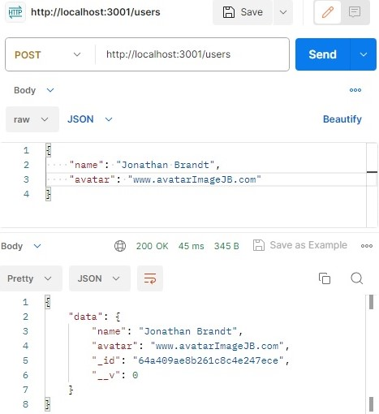

# WTWR (What to Wear?): Back End

## Intro

This project is focused on creating a server for the WTWR application.
A database was created and connected to the server. Schemas were created for our two resources in this project, a user and a clothing item. We started with configuring our first routes and controllers for both users and clothing items and included error handling by determining the error type using its name.

The eventual goal is to create a server with an API and user authorization.

## Project Features

- Express.js
- Mongoose
- Schemas and Models
- Controllers
- Error Handling

This project was tested using two tools, Postman and GitHub Actions, with the help of a MongoDB server.

